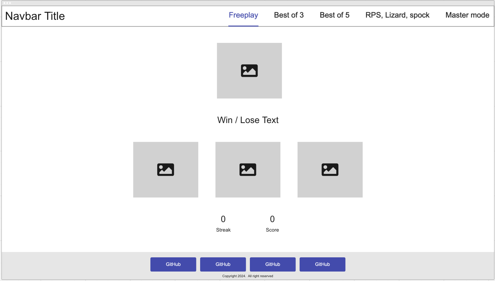
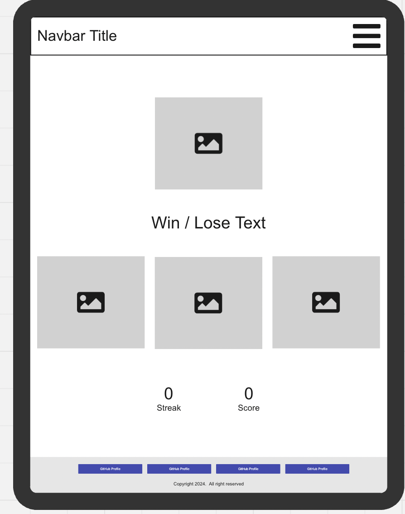
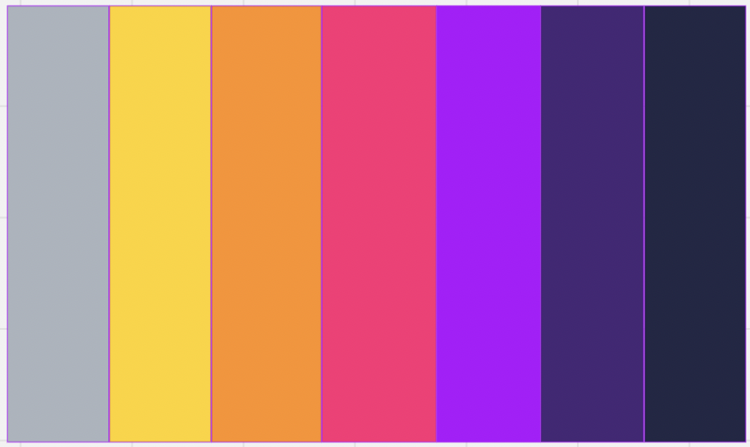
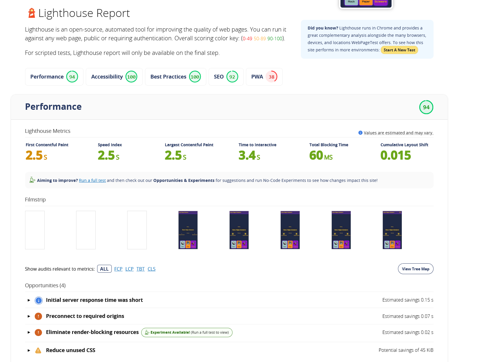

# **Team Retrowave: Rock paper scissors** 

## **Overview**

### **Purpose**

The purpose of our project is to make a fun and engaging game for players. This Rock Paper Scissors game can be used to settle minor decisions, or simply to pass time. Users will be  playing interactively against the computer, getting constant feedback on their performance. We hope to keep players entertained by engaging all their senses e.g. with visuals and sound.

### **Target Audience**

Our game is aimed at casual gamers of all ages who enjoy playing quick, simple games. For those on the go, it offers a mobile version with touch friendly controls. Those who enjoy classic arcade games or th retro aesthetic may have a particular affinity to this game, as it may give them a sense of nostalgia.

**User Stories**

### **Must-Have User Stories**

**User Story 1:**   
As a Player I can play against an opponent so that it works

**Acceptance criteria:**

* true random logic  
* Opponent choice to display  
* Opponent choice to be compared with player choice

**Tasks:**

* JS RNG  
* JS function to compare against player  
* JS function to pass win/loss/tie to score function

**User Story 2:** 
As a Player I can choose between gameplay options so that I can interact with the game 

**Acceptance criteria:**

* Choice offered choice is played 
* Pleasing design
* Basic click feedback 

**Tasks:**

* Create html to contain choices 
* Style appropriately
* Create JS event listeners to write to variable. 

### **Should-Have User Stories**

### **User Story 1:**
As a Employer I can see the GitHub profiles of the developers so that I can further explore their work 

**Acceptance criteria:**
* Anchors clearly linking to developers GitHub profiles. 
* Appropriately styled anchors that are eye catching and accessible. 
* Footer does not obscure main content. Fixed footer. 

**Tasks:** 
* Adapt Bootstrap footer example match games brand. 
* Add FontAwesome for GitHub logo in GitHub profile anchors. 

### **User Story 2:**

As a Player I can access a navbar so that I change gamemode

**Acceptance criteria:**

* Gamemode can be changed from navbar.  
* Navbar is responsive.  
* Navbar highlights current gamemode.

**Tasks:**

*  Take Bootstrap navbar and style appropriately.  
* Mock placeholder pages.  
*  Class to represent active gamemode.  
*  Source logo.

### **User Story 3:**

As a Player I can See a score counter so that track my wins

**Acceptance criteria:**

* Counter is cohesive with the page design  
* Counter increments  
* Total : wins : losses

**Tasks:**

*  Create html container  
* Create JS reads the game over condition write to "wins" or "Losses"  
* Total score increment

### **Could-Have User Stories**

### **User Story 1:**

As a User I can see current winning streak so that I remain engaged and feel rewarded

**Acceptance criteria:**

* Current winning streak is recorded.  
* Maximum winning streak is recorded.  
* Current and Maximum saved between browser sessions.

**Tasks:**

* Increment current streak on win.  
* Reset streak on loss, save into maximum if highest.  
* Save to local storage regularly..

### **User Story 2:** 

As a User I can choose nerd mode so that I can be kept engaged

[Spock & Lizard List](https://i.etsystatic.com/15843844/r/il/dcadfa/4417678458/il_fullxfull.4417678458_9n6c.jpg)

[Spock & Lizard Diagram](https://static.wixstatic.com/media/903056_39aa9523c70a428684be9744580b0b1b~mv2.png/v1/fill/w_568,h_568,al_c,q_85,usm_0.66_1.00_0.01,enc_auto/903056_39aa9523c70a428684be9744580b0b1b~mv2.png) 

**Acceptance criteria:**
* Spock & Lizard can be played
* Helper text is visible to indicate effectiveness of Spock & Lizard. 
* Computer needs to be able to play.

**Tasks:** 
* Create new page for gamemode 
* Add Spock & Lizard buttons. 
* Add JavaScript to handle Spock & Lizard effectiveness. 

## **Design Decisions**

### **Wireframes**

Desktop:  

The player has the choice of picking from the bottom three cards, and their win/lose result will be revealed once the top card flips to show the computer's choice

Tablet:

 
Mobile Phone:  

 

 To adjust our game to a mobile phone, we made sure the player's choices (rock, paper of scissors) were near the middle of the screen near the thumbs for easy accessibility. 

Colour palette:   

Our colour palette aimed to remind users of the retro gaming aesthetic. The bright colours will keep the users engaged, and they are all cohesive so that it is pleasing to the eye.

**Font Family:**

[https://fonts.google.com/specimen/Orbitron?preview.text=Rock%20paper%20scissors\&categoryFilters=Appearance:%2FTheme%2FTechno](https://fonts.google.com/specimen/Orbitron?preview.text=Rock%20paper%20scissors&categoryFilters=Appearance:%2FTheme%2FTechno)

The font we decided to use aligns with our retro theme, reminding players of old school gaming.

### **Accessibility Considerations**

some care was taken in the design stage of the project to ensure that all essential text and gameplay elements have sufficient contrast against any background colours.

## **Features Implementation**

### **Core Features (Must-Haves)**
* **Basic page layout:** The game needs a slate to sit on, this needs to be intuitive to navigate and pleasing to the eye. it also needs to adhere to accessibility guidlines and use semantic html.
* **Footer containing our github profiles** As this project is primarily a portfolio item, a footer containing buttons to link to each of our gitHub profiles is essential.
* **User selects rock, paper or scissors:** The basic rock paper scissors game is our MVP, first we needed to give the user the ability to select a play option, and for our Javascript to get the user choice in numerical form.
* **Random computer play choice:** The next stage in our MVP's gameplay is for the computer opponent to make a selection, for this we used a random number generator. the value of this is then passed to a checkWin() function along with the user choice number
* **Game state feedback:** Once the script has compared the user choice and computer choice, it returns a game state (win/loss/tie). this needs to be fed back to the user as on-screen text.

### **Advanced Features (Should-Haves)**

* **score counters** to encourage the user to play multiple games, a score counter to track the user's streak of wins will be used. this same score counter can later be adpted to contain other types of score in other game-modes. 
* **** Description of the implemented feature.

(Include all should-have features)  
 **Guidance:** Include any advanced features you implemented during Phase 3: Should User Stories Implementation & Any Advanced Features. Explain how these features enhance user experience and their alignment with the acceptance criteria.

### **Optional Features (Could-Haves)**

* **Feature 1:** Description of the implemented feature (if any).  
* **Feature 2:** Description of the implemented feature (if any).

(Include any could-have features that were implemented or considered)  
 **Guidance:** If any could-have features were implemented, describe them here. This is an opportunity to showcase extra work done beyond the initial scope. But remember \- keep it simple\! Focus on the Must stories first. Could user story features are commonly earmarked for future project iterations.

## **AI Tools Usage**

ChatGPT was used to change the Best of 3 Mode to Best of 5.

## **Testing and Validation**

### **Testing Results**

To test our site for accessibility and performance, we used a web version of the lighthouse service found at https://www.webpagetest.org/result/241114_BiDcYM_6F4/#PWA.
we are please with the result

### **Validation**

We checked each html document individually using w3c markup validator, we found some minro errors involving snippets of deleted code being left behind, these were easy to address and all html pages now pass validation. Our CSS also passes validation using the same tool, though we recognise the need to pay more attention to the structure the style sheet to better organise the information.

We checked our Javascript documents with JShint and found no issues, though, given more time we would work as a team to improve the hardMode.js layout and structure to make it easier to read and understand.

## **Deployment**

### **Deployment Process**

Deployed using GitHub Pages grabbing from main branch.

## **Reflection on Development Process**

### **Successes**

Effective use of AI tools, including GitHub Copilot and DALL-E, and how they contributed to the development process.

### **Challenges**

Our greatest challenges was grasping Git collaboration, we kept running into problems with merge conflicts which in some cases presented a chance of our main branch being overwritten with an older revision.

We also spent some time wrestling with Bootstrap to achieve the look a feel we desired.

### **Final Thoughts**

Provide any additional insights gained during the project and thoughts on the overall process.  
 **Guidance:** Begin drafting reflections during Phase 1 and update throughout the project. Finalize this section after Phase 4\. Highlight successes and challenges, particularly regarding the use of AI tools, and provide overall insights into the project.

## **Code Attribution**

**Flaticon License (rock paper scissors logo)-** Rock paper scissors icons created by Freepik \- Flaticon

Free for personal and commercial purpose with attribution. [More info](https://www.flaticon.com/free-icon/rock-paper-scissors_6729598?term=rock+paper+scissors&page=1&position=11&origin=search#)

**OpenMoji  (Rock icon, paper icon, scissors icon,)** 

Licensed under: Creative Commons Share Alike License 4.0

[**https://openmoji.org**](https://openmoji.org)

**Neon glow effect and flicker animation walkthrough**

[**https://css-tricks.com/how-to-create-neon-text-with-css/**](https://css-tricks.com/how-to-create-neon-text-with-css/)

## **Future Improvements**

- Adding a multiplayer mode.
- Using a single JS file to handle multiple game modes.
- Further improvements to UI aesthetics.